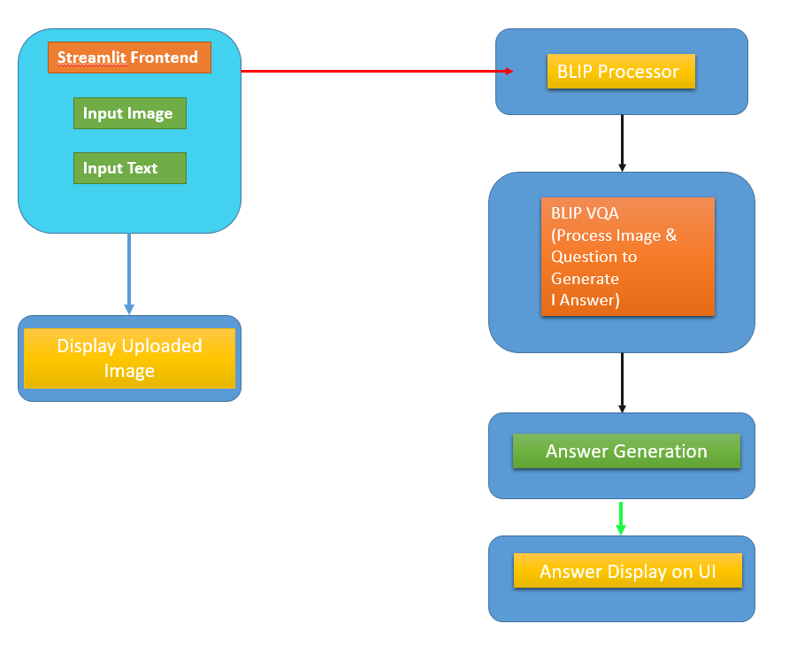
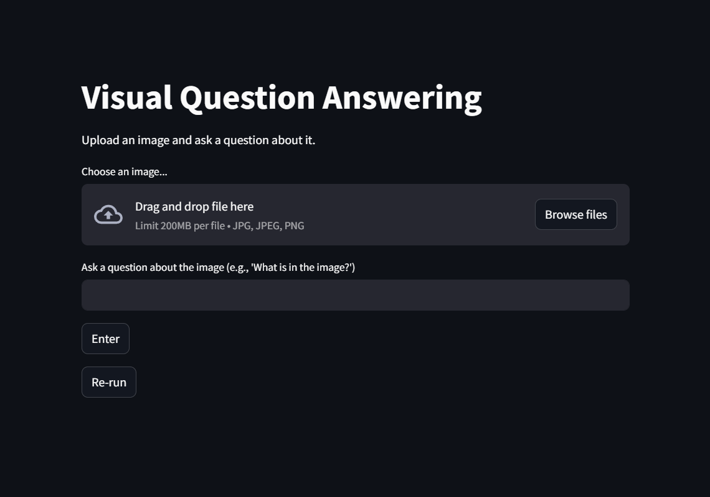
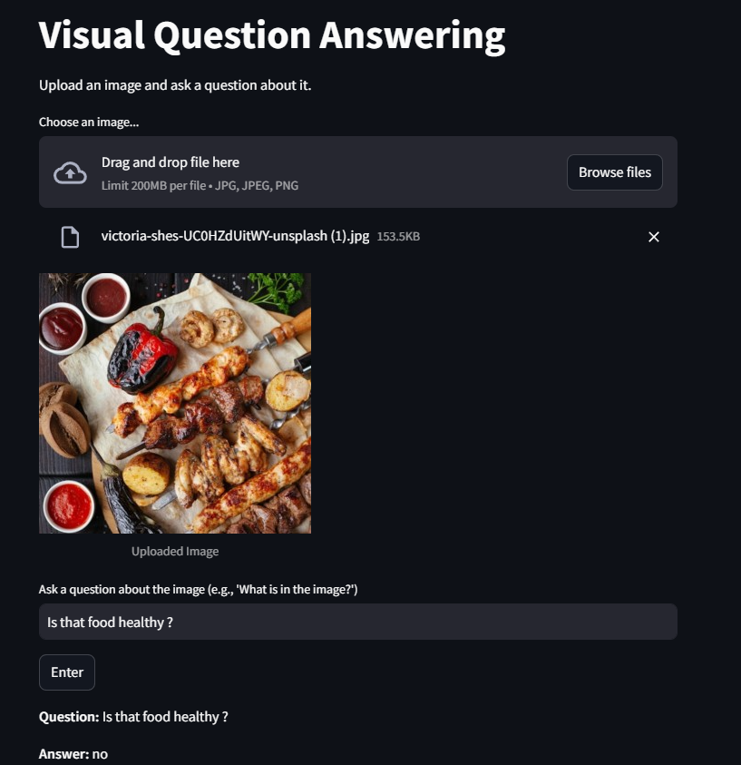

<h1>Visual Question Answering (VQA) Project</h1>

My project involves creating a Visual Question Answering (VQA) system using Streamlit and a pre-trained BLIP (Bootstrapped Language-Image Pretraining) model from Salesforce. The system allows users to upload an image, ask a question about the image, and receive an AI-generated answer. The process leverages a model capable of understanding the visual content of the image along with natural language to provide answers.

<h2>Diagram:</h2>

<h2>Steps in the Project Flow:</h2>

<ol>
<li><strong>User Interface (Streamlit Frontend):</strong> The user uploads an image and enters a question through a web interface created using Streamlit.</li>

<li><strong>Image Upload:</strong> Once the image is uploaded, it is displayed on the webpage. The image is also converted into RGB format using the Python Imaging Library (PIL).</li>

<li><strong>Question Input:</strong> The user inputs a question related to the uploaded image. For example, "What is in the image?" or "How many people are there?"</li>
<li><strong>Processor (Preprocessing):</strong> The uploaded image and the input question are passed into the BLIP processor, which tokenizes the text and converts the image into a format suitable for model inference.</li>

<li><strong>Model (BLIP for Question Answering):</strong> The BLIP model processes both the image and the question to generate a suitable response. If a GPU is available, the model runs on it for faster processing.</li>

<li><strong>Answer Generation:</strong> The model generates an answer to the question using its pre-trained language-image reasoning capabilities. It then decodes the result to provide a human-readable output.</li>

<li><strong>Answer Display:</strong> The generated answer is displayed back to the user on the Streamlit interface.</li>

<li><strong>Re-run Option:</strong> The user can choose to "Re-run" the app to upload a new image or ask a different question.</li>
</ol>
<h2>User Interface</h2>

<h2>Output</h2>

